# Host Layer: macOS with VMware Fusion

This document details the setup of the physical host machine, which serves as the foundation for the entire Homelab. The goal of this layer is to create a stable, secure, and isolated environment for running virtual machines.

The chosen stack is:
- **Host OS:** macOS
- **Virtualization:** VMware Fusion
- **Storage:** Two dedicated, encrypted external SSD

## Core Security Principles

Two key principles are enforced at this layer to enhance security:

### Principle 1: Isolate the Virtualization Process

Virtualization software is complex and, like any software, can have vulnerabilities. To mitigate the risk of a potential VM escape (where a process breaks out of the guest VM and gains access to the host), we run VMware Fusion under a **dedicated, non-administrator user account** on macOS.

This ensures that even in a worst-case scenario, an attacker would be confined to an unprivileged user account on the host, severely limiting their ability to access sensitive host data or gain administrative control.

### Principle 2: Encrypt Data at Rest

All virtual machine files—including virtual disks (`.vmdk`), snapshots, and configuration files—are stored on a dedicated external SSD. This entire drive is encrypted at the host level using macOS's built-in APFS encryption.

This guarantees that if the physical drive is ever lost or stolen, the data remains completely inaccessible.