# Guest Layer: Debian

This document details the creation of the main "Services VM," transforming a bare virtual machine into a hardened, efficient, and secure host for all containerized applications.

This layer is built on four pillars:
1. **Debian Linux** installation.
2. **ZFS filesystem** for data integrity and backups.
3. **Docker Engine** environment using User Namespace Remapping.
4. **Backup Strategy** combining ZFS snapshots with BorgBackup.

