# 5. Backup and Recovery Strategy

The backup strategy for this Homelab is designed around two primary goals: **maximum data consistency** and **minimal service downtime**. This is achieved by combining the features of **ZFS** with the one from **BorgBackup**. This document explains the architecture, workflow, and configuration of this system.

---

## The Architecture

A key architectural decision is to create **one dedicated Borg repository for each ZFS dataset**. Instead of backing up all services into a single, monolithic archive, each service's data is isolated in its own encrypted repository.

This approach provides several significant advantages:

- **Isolation & Resilience:** Corruption or an issue in one service's backup history (e.g., for a less critical app) has zero impact on the backups of your other, more critical services. This prevents a single point of failure in your backup system.
- **Granular Retention Policies:** You can apply different pruning rules to different services. For example, you can configure the system to keep a year of daily backups for your source code repository but only 90 days of backups for a media server's metadata.
- **Simplified Recovery:** In a disaster, restoring a single service is simple and clean. You only need to interact with its dedicated, smaller repository, which makes the recovery process faster and less error-prone.

---

## The Backup Workflow

The power of this setup comes from the synergy between ZFS's instantaneous snapshots and Borg's efficient, deduplicating backups. This workflow guarantees a perfect, point-in-time backup with service downtime measured in seconds, not minutes or hours.

The process unfolds in five distinct steps:

1. **Stopping Services:** All Docker containers are gracefully stopped. This is the first step because we need to ensure applications have cleanly flushed all their data to disk and that databases are in a consistent, non-transacting state.
2. **Create Atomic Snapshot:** An instantaneous ZFS snapshot of all service datasets is taken. This acts as a perfect, read-only "photograph" of the data at that exact moment. This operation typically takes less than a second to complete.
3. **Resume Services:** Immediately after the snapshot is secured, all Docker containers are restarted. The total downtime for your services is only the time it takes to complete the first two steps, which is typically just a few seconds.
4. **Perform Backup from Snapshot:** The BorgBackup process begins. Crucially, it reads data from the **static and unchanging ZFS snapshot**, not the live filesystem. This decouples the backup duration from service uptime. The backup can take as long as necessary without being affected by ongoing changes in the live services, completely avoiding issues with file locks or inconsistent data.
5. **Prune and Cleanup:** After the backup is successfully sent to the offsite location, Borg prunes any old archives according to your retention policy. Finally, the temporary ZFS snapshot is destroyed to reclaim space on the data disk.

---

## Disaster Recovery Concept

Restoring data is straightforward due to the granular repository architecture. The general process involves:
1. Setting up a new server and installing Borg.
2. Using the `borg mount` or `borg extract` command with the correct repository path, your passphrase, and (if needed) the repository's recovery key.
3. Copying the required data back to its original location.

Because each service has its own repository, you can restore a single failed service quickly and without affecting any others.