# Service Layer: Networking and Applications

This document explains the networking architecture that allows all services to run securely and communicate effectively. It also provides an overview of the services included in this repository.

---

## Core Networking Concepts

### 1. The Central Hub: Caddy Reverse Proxy

A single **Caddy** container acts as the "hub" and the sole entry point for all HTTP/S traffic into the Homelab. It is the only service that exposes ports to the host VM. Its responsibilities are:

- **Traffic Routing:** It inspects incoming requests and routes them to the correct backend service based on the requested domain name (e.g., `gitea.homelab.lan`).
- **Automatic HTTPS:** Caddy automatically provisions and renews TLS certificates for all services, ensuring all traffic is encrypted with HTTPS. For internal-only domains, it runs its own internal Certificate Authority.
- **Decoupling:** Services don't need to know about each other. They only need to be reachable by Caddy.

### 2. The Spokes: Isolated Service Stacks

Each service or group of related services (a "stack," like Gitea and its database) is treated as a "spoke." To achieve maximum security and isolation, every spoke is deployed onto its own **dedicated, private Docker network**.

- **Total Isolation:** Containers on one private network (e.g., `git_net`) cannot see or interact with containers on another private network (e.g., `photo_net`). This prevents a potential compromise in one application from spreading to others.
- **The Caddy Bridge:** The Caddy container is the **only component connected to all of these private networks**. This unique position allows it to act as the central router that can forward traffic to every spoke, while the spokes remain completely isolated from each other.

### 3. The Map: Internal DNS Server

An independent DNS server (running in its own VM, e.g., AdGuard Home or Pi-hole) acts as the "map" for the entire network. Its roles are:

- **Authoritative Local DNS:** It resolves all custom local domains (e.g., `git.homelab.lan`, `photo.homelab.lan`) to the single, static IP address of the Caddy container.
- **Ad & Tracker Blocking:** It provides network-wide filtering for all devices in your home.
- **Replaces MagicDNS:** This custom DNS setup completely replaces Tailscale's MagicDNS, providing more control and network-wide ad blocking for all devices, whether they are on the local network or connected remotely via Tailscale.

### 4. The Gateway: Unified Remote Access with Tailscale

A single **Tailscale** container provides secure, unified remote access to the entire Homelab. It operates in two key roles:

- **Subnet Router:** It advertises your local LAN (e.g., `xxx.xxx.0.0/24`) to your private Tailscale network. This allows your remote devices (phone, laptop) to securely access your internal services as if you were at home. Tailscale ACLs are used to restrict remote clients so they can only access the DNS server and the Caddy VM, not your entire local network.
- **Exit Node:** You can configure your remote devices to route all their internet traffic through your home network.

---

## Service Deployment

All services are defined as Docker Compose stacks. The configuration for each is located in a dedicated subdirectory within `/services`.

- **`/services/reverseproxy/`**: Contains the `docker-compose.yml` and `Caddyfile` for the main reverse proxy.
- **`/services/git/`**: Contains the `docker-compose.yml` for the Gitea source control service and its PostgreSQL database.
- **`/services/photo/`**: Contains the `docker-compose.yml` for the Photo service.
- ...and so on for other services.

Each `docker-compose.yml` file is written to be self-contained for its specific application stack and is configured to connect to its dedicated, external Docker network that you create and manage.
