# The Central Hub

In the homelab's "hub-and-spoke" architecture, the Caddy reverse proxy is the **central hub**. It's the sole entry point for all web traffic, routing requests to the correct backend services. This centralization is a core security principle, as it's the only service that needs to expose ports to the host VM.

Caddy's primary responsibilities are:

 - **Traffic Routing:** It directs incoming requests to the correct service based on the domain name, like `photo.homelab.lan`.
 - **Automatic HTTPS:** Caddy handles all TLS encryption, even creating its own internal Certificate Authority for local domains to provide trusted connections without any manual setup.
 - **Service Bridging:** It's the only component connected to every isolated service network, allowing it to "bridge" traffic to the spokes while they remain isolated from each other.

 -----

### How a Request Flows

Putting it all together, here is the journey of a single request from a remote user to a service:

1. **Request**: You type `https://git.homelab.lan` into your browser.
2. **DNS Resolution**: Your device queries the internal DNS server, which resolves `git.homelab.lan` to the static IP of the Caddy container.
3. **Caddy Entrypoint**: The request arrives at the Caddy container on port 443.
4. **Routing**: Caddy reads the request's `Host` header, finds the matching `git.homelab.lan` block in its Caddyfile, and terminates the TLS connection.
5. **Proxying**: Caddy then forwards the plain HTTP request to the `gitversioncontrol-gitea` container on its private network at port `3000`.
6. **Response**: The Gitea container processes the request and sends the response back to Caddy, which encrypts it and sends it back to your browser.



-----

### Docker Compose Configuration

The deployment of Caddy is defined in its `docker-compose.yml` file.

Here's a breakdown of an example configuration:
```yaml
services:
 caddy:
  build: .
  container_name: central_hub
  restart: unless-stopped

  # Connects Caddy to all isolated service networks
  networks:
   - central_hub_net
   - photo_net

  # Exposes the standard web ports to the host VM
  ports:
   - "80:80"
   - "443:443"
   - "443:443/udp"

  volumes:
   # Mounts the configuration file
   - ./Caddyfile:/etc/caddy/Caddyfile:ro

   # Persists TLS certificates and other data
   - caddy_data:/data

volumes:
 caddy_data:

# Defines all networks as external
networks:
  central_hub_net:
    external: true
  photo_net:
    external: true
```

 - `networks`: This is the most critical section for the hub-and-spoke model. By connecting Caddy to every service network, it gains the ability to communicate with and route traffic to the containers on those otherwise isolated networks.
 - `ports`: Caddy listens on the standard HTTP/S ports. Port `80` is used for HTTP requests, which Caddy typically redirects to HTTPS. Port `443` is for secure HTTPS traffic, and `443/udp` enables the modern HTTP/3 protocol.
 - `volumes`:
   - The `Caddyfile` is mounted as a read-only configuration file from the host.
   - The `caddy_data` named volume is essential. It stores Caddy's generated data, most importantly the TLS certificates and the local Certificate Authority, ensuring they persist even if the container is recreated.

-----

### Caddyfile Routing Logic

The `Caddyfile` is a simple text file that defines how Caddy handles incoming requests.

```caddy
# Git Version Control Service (Gitea)
photo.homelab.lan {
  reverse_proxy photo-immich-server:2283
  tls internal
}
```

Each block in the file defines a route:

 - `photo.homelab.lan`: This is the site address. When Caddy receives a request for this domain, this block is activated.
 - `reverse_proxy  photo-immich-server:2283`: This is the core instruction. Caddy uses Docker's internal DNS to find the container named ` photo-immich-server` on the shared network and forwards (proxies) the request to its internal port `2283`. The backend service doesn't need to expose any ports to the host.
 - `tls internal`: This directive tells Caddy to use its own automatically managed internal Certificate Authority to serve a trusted TLS certificate for this local domain.
